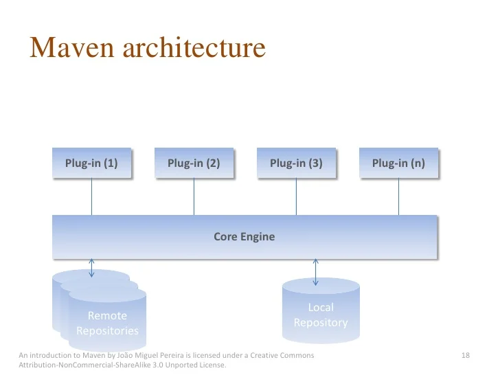

# Maven Overview

## What is Maven?

- **Maven** is a tool used to:
  - Compile and validate code.
  - Analyze test cases in the code.
  - Manage the building, reporting, and documentation of a project from Source Control Management (SCM).

- Maven projects are configured through the **Project Object Model (POM)**.
  - **POM** is an XML file (`pom.xml`) that contains:
    - Documentation for objects, properties, methods, and events.
    - Project configuration details.

## Capabilities of Maven

- Containerizes project information.
- Models the software project.
- Manages the build process.
- Gathers data about the project to build it.
- Documents the software and the project.
- Generates deployable artifacts (e.g., JAR, WAR, EAR files) from source code.
- Completes, packages, tests, and distributes the source code.
- Generates reports and creates a project website.

## Maven Build Lifecycle

Maven uses a pre-defined and ordered set of steps to run the build lifecycle. The build tasks performed in each phase depend on the configuration in the project file, specifically the selected packaging type.

- Maven relies on the **build lifecycle** to define the process of building and distributing artifacts (e.g., JAR files, WAR files).
- There are **three built-in build cycles**:
  1. **Default**: Handles project building and deployment.
  2. **Clean**: Handles project cleaning.
  3. **Site**: Handles project site generation.


## Maven Artifacts

- A **Maven artifact** is a file resulting from packaging a project (e.g., JAR, WAR, EAR, or XML files).
- Artifacts are stored in repositories (local or remote) so they can be used as dependencies in other projects.
- Artifacts are identified by three components:
  1. **Group ID**: A unique identifier for a group of related artifacts (e.g., Java package names).
  2. **Artifact ID**: A unique identifier for the artifact within the group.
  3. **Version**: Identifies the release or build number of the project.

### maven repository flow


### Maven Dependency Resolution Steps
1. **Step 1**: When a developer executes an `mvn` command, Maven first checks the **local repository** for the required dependencies or plugins.
2. **Step 2**: If not found in the local repository, Maven searches the **remote repository**.
3. **Step 3**: The required dependencies or plugins are downloaded from the remote repository and stored in the local repository.
4. **Step 4**: Maven uses the locally stored dependencies to generate the desired output.

## Project Object Model (POM)

- The **POM** is an XML file located at the root of the project (`pom.xml`).
- The POM includes:
  - Project information.
  - Configuration details for building the project.
  - Configuration for plugins and goals.
  - Dependencies for the project.
  - Repositories used.

### Example Configurations in POM
- **Source Directory**: Specifies where the source code is located.
- **Target Directory**: Specifies where the compiled code and packaged artifacts are stored.

## Declaring Dependencies in Maven

While declaring dependencies, the coordinates of the artifacts must be provided:

- **Group ID**: A unique identifier for the group of related artifacts.
- **Artifact ID**: Identifies the artifact within the context of the group.
- **Version**: Specifies the release or build number of the project.

```xml
<dependency>
  <groupId>com.example</groupId>
  <artifactId>example-artifact</artifactId>
  <version>1.0.0</version>
</dependency>
