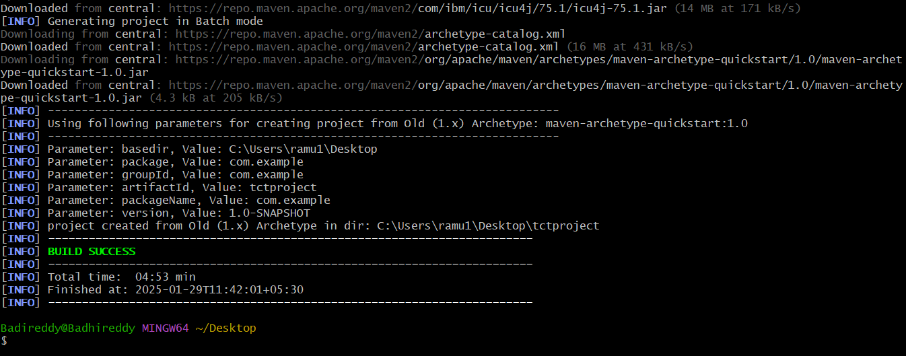
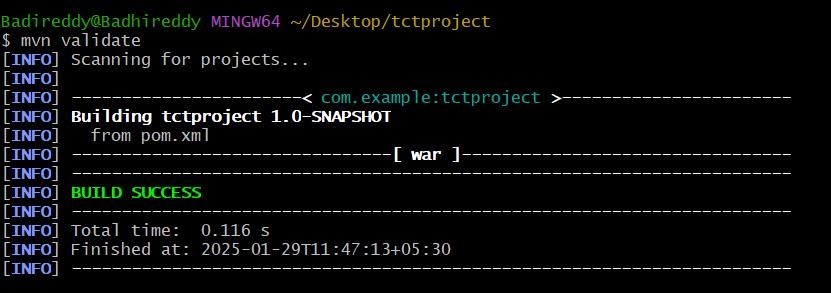
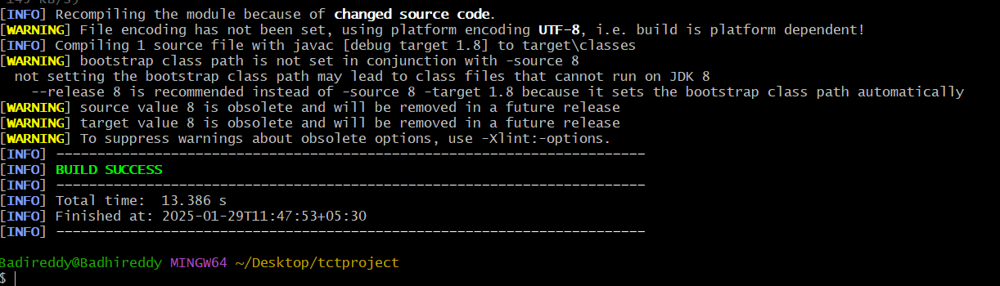
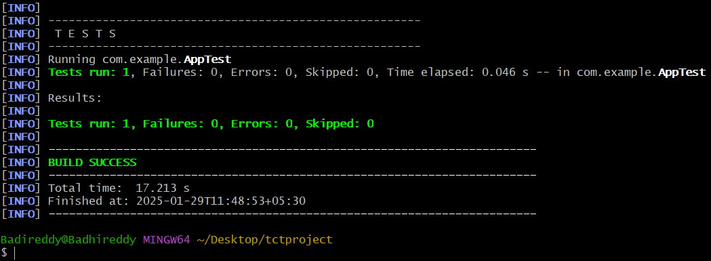
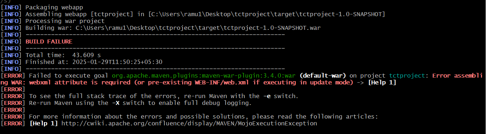
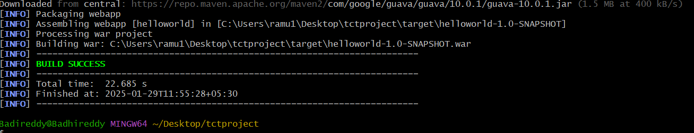
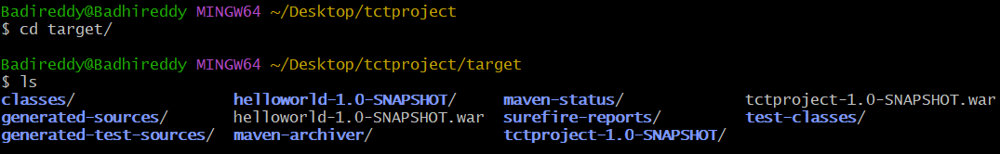

### Creating a project using maven
mvn archetype:generate -DgroupId=com.example -DartifactId=maventask -DarchetypeArtifactId=maven-archetype-quickstart -DinteractiveMode=false

### mvn validate

### mvn compile

### mvn test

### mvn package

### mvn package

#### using mvn package i got .war file
